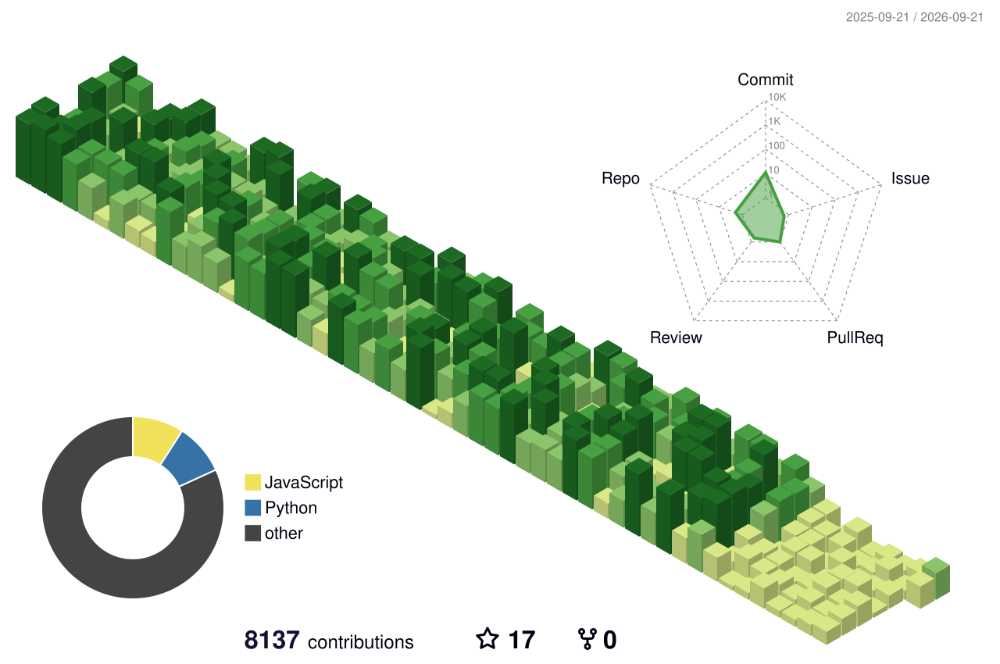

 

## 💫 About Me

- 👾 Hey, I'm **Amir Hesam**
- 🛠 Backend developer with a bit of frontend
- ⚙️ Django • Go Fiber • React • Docker • REST APIs
- 🧠 Clean architecture, developer experience, and readable code matter to me

 

## 💻 Tech Stack

**Languages**

**Hosting / SaaS**

**Frameworks, Platforms & Libraries**

**Servers**

**Databases / ORM**

**DevOps & Tools**

**CI/CD & VCS**

**Network**

 

## 🤝 Soft Skills

- 🗣️ Clear, direct communication
- 🧩 Strong problem-solving and debugging instincts
- 🤝 Comfortable working independently or as part of a team
- 📚 Quick to pick up new tools and stacks
- 🎯 Attention to detail and code quality
- ⏱️ Reliable with deadlines and follow-through

 

## 🐍 Contribution Activity

<picture>
  <source media="(prefers-color-scheme: dark)" srcset="https://raw.githubusercontent.com/hesam21188/hesam21188/output/github-contribution-grid-snake-dark.svg" />
  <source media="(prefers-color-scheme: light)" srcset="https://raw.githubusercontent.com/hesam21188/hesam21188/output/github-contribution-grid-snake.svg" />
  
</picture>

  

 

## 📫 Let's Connect

 

